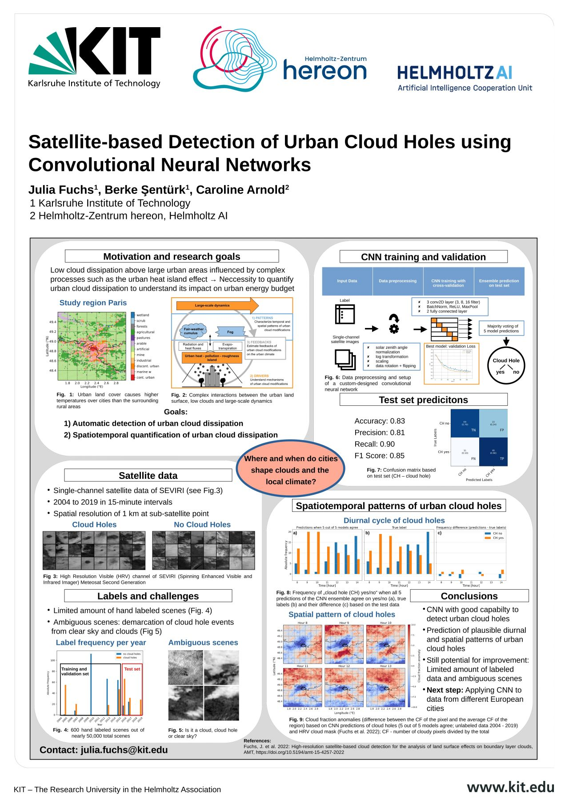

# CNN-Based Satellite-Based Urban Cloud Hole Detection

This project's objective is to use satellite data and CNNs to identify cloud holes over specific European cities.

When there is fog and low stratus clouds, cloud holes are forming. These conditions, which are usually found in Europe during the winter, are linked to a stable and moist boundary layer under cool conditions. It has been demonstrated that the urban heat island effect causes cloud holes to form in the morning over specific urban areas. This study aims to create a data base with satellite photos labeled as "cloud holes" in order to better understand related processes and the frequency of occurrence of these cloud holes.

## CNN

Approaches experimented such as 
- Custom CNN models
- Pretrained models w/o data augmentation (e.g. colorJitter)

Next steps,
- Few-Shot Learning, Zero-Shot Learning, Transfer Learning, and Finetuning with pretrained models.

## Satellite data - high resolution visible (HRV) channel
- Years: 2004-2019
- Months: November, December, January, February
- Temporal resolution: every 15 minutes, 9:00 - 15:00
- Spatial resolution: 1km at nadir --> e.g. 2km for Paris
- City: Paris
- Total size of data: ~ 3 GB per city
- No. of scenes: ~900 per month (~20MB) --> 15 years * 4 months * 900 = 54000 scenes in total
- No. of cloud hole labels: not many labels yet

## Label
- 2 classes: cloud hole (CH), non-cloud hole (nCH, incl. clear sky, snow, hetreogenous clouds)
- only few days for Paris (18 days * ~ 12 scenes per day = 216 labels)

## Authors and acknowledgment

- Berke Şentürk (Karlsruhe Institute of Technology) 
- Dr. Julia Fuchs (Karlsruhe Institute of Technology)
- Dr. Caroline Arnold (Helmholtz AI)

